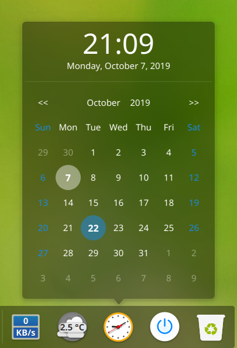
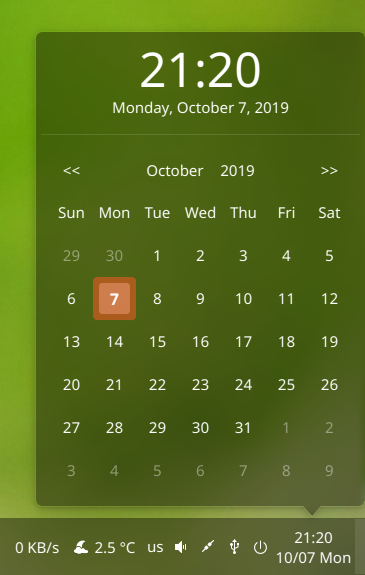

DDE Dock Clock Plugin
=====================

This is a clock plugin with a calendar for deepin-dock, with customization of the format and theme.





### Installation Guide ###
Compiling using Qt Creator or using the following command:
```
qmake
make
```
Installation: 
```
./install.sh
```

Uninstall:
```
./uninstall.sh
```
### Acknowledgment ###
This Plugin was initially inspired by [Sonichy's DDE_DOCK_DateTime](https://github.com/sonichy/dde-dock-datetime)