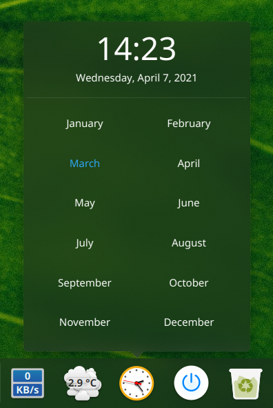
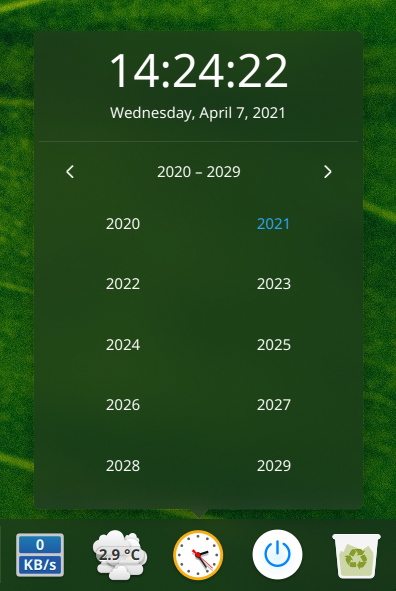

DDE Dock Clock Plugin
=====================

This is a clock plugin with a calendar, lunar phases and zodiac signs for deepin-dock, with customization of the format and theme.






### Installation Guide ###
Compiling using Qt Creator or using the following command:
```
mkdir build
cd build
qmake ..
make
```
Installation: 
```
./install.sh
```

Uninstall:
```
./uninstall.sh
```

### Changes ###
Ver 1.3 - added selection of months and years
Ver 1.2 - added lunar phases and zodiac signs (double click to show or hide)

### Acknowledgment ###
This Plugin was initially inspired by [Sonichy's DDE_DOCK_DateTime](https://github.com/sonichy/dde-dock-datetime)